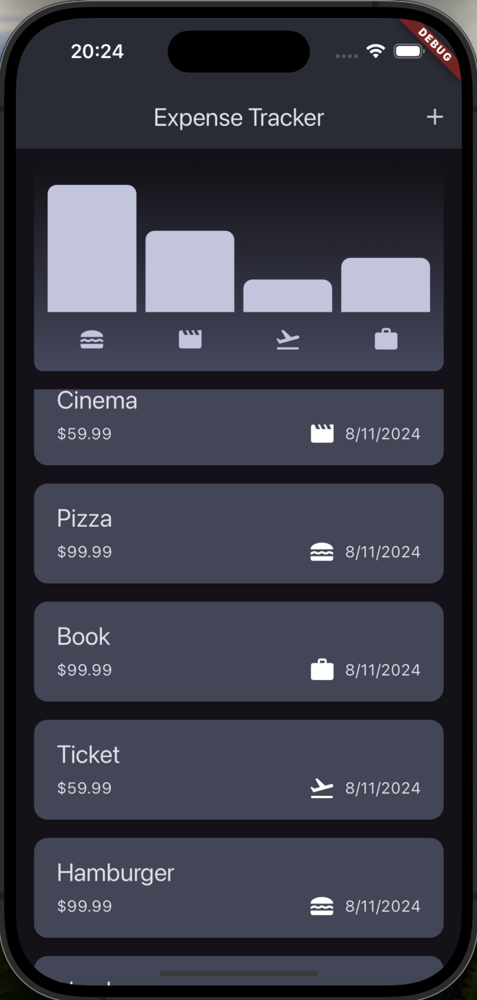
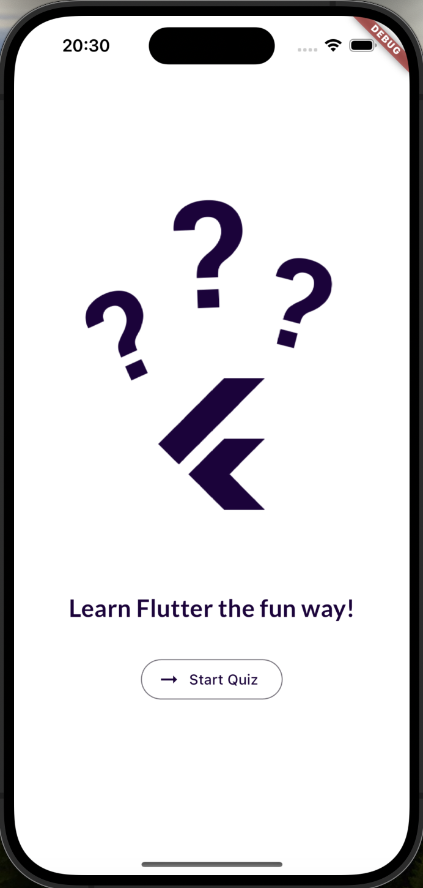
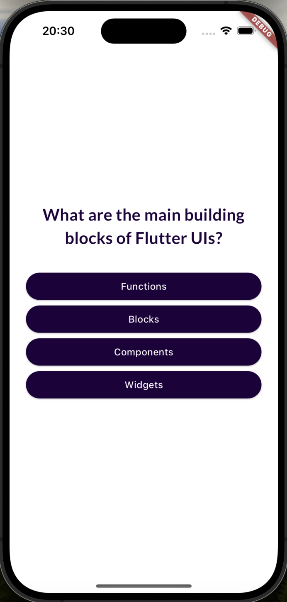
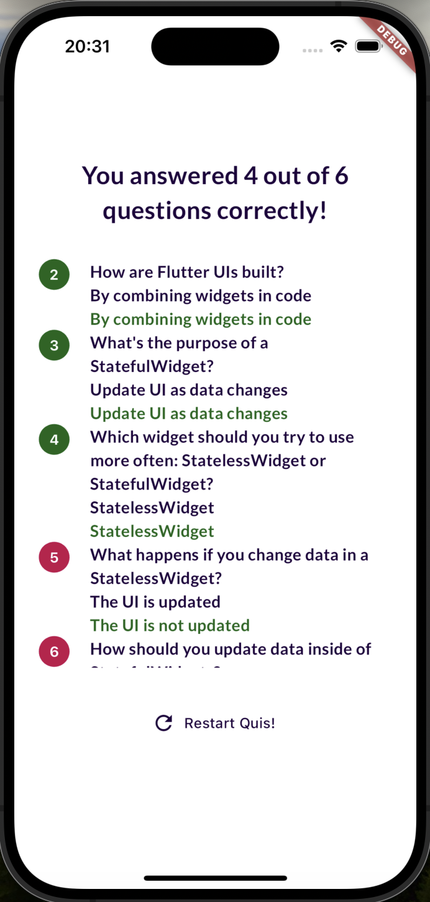
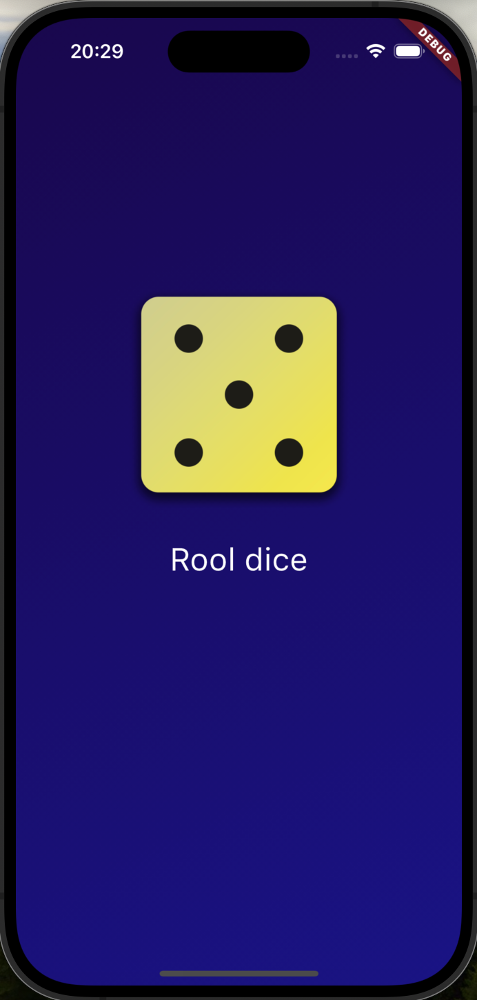

# flutter_udemy

This repository contains apps created in this Udemy course:

**Flutter & Dart - The Complete Guide [2024 Edition]**  
A Complete Guide to the Flutter SDK & Flutter Framework for building native iOS and Android apps

- [Udemy course: Flutter & Dart - The Complete Guide](https://www.udemy.com/course/learn-flutter-dart-to-build-ios-android-apps/?couponCode=ACCAGE0923)

## Overview

This repository so far includes the following apps:

- Expense Tracker
- Quiz App
- Roll dice

## Expense Tracker

The Expense Tracker app allows users to track their daily expenses with an intuitive UI. The app categorizes expenses and displays them in an easy-to-read format.

### Features

- **Add Expenses:** Easily add expenses with a description, amount, and category.
- **View Expenses:** See all your expenses in a list, with clear labels and dates.
- **Track Spending:** Visual representation of spending in different categories.
  
## Quiz App

The Quiz App is made for asking and answering questions with a result screen at the end. The questions and its answers are about flutter right now but they can be personalized in the code.

- **Answer Questions:** Test your knowledge and memorize what you've studied.
- **View Questions answered:** See all your answers and check which were correct or incorrect.
- **Restar Quiz:** Option to retake the quiz.

## Roll dice

This app simulates rolling a dice, which can help make decisions or simply be used for fun.

### Features

- **View Random Dice Roll:** See the result as if rolling a physical dice.

### How to Run these Apps

1. Clone this repository.
2. Open the project in your favorite IDE (like Visual Studio Code).
3. Run `flutter pub get` to install the dependencies.
4. Use `flutter run` to launch the app on your emulator or physical device.